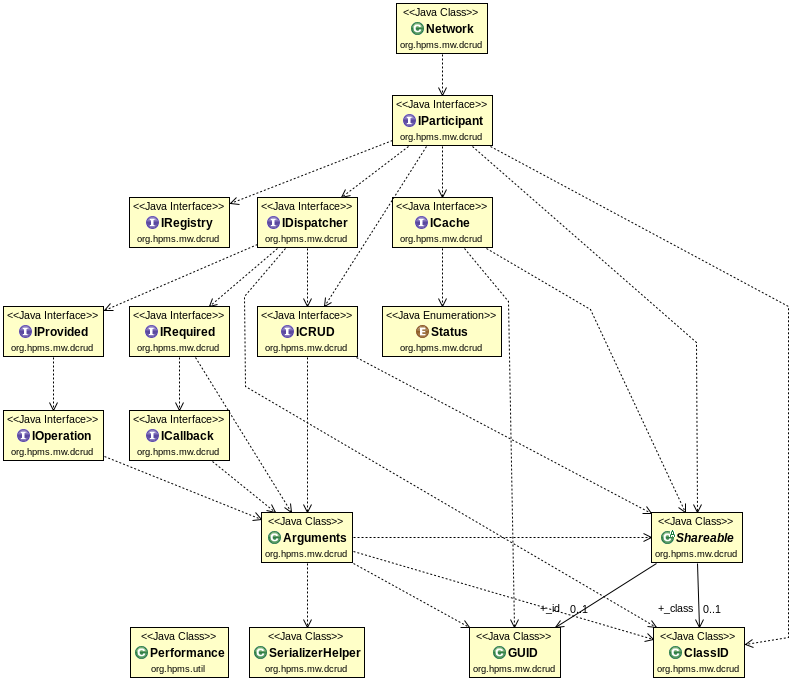

DCRUD
=====

Goal
----

Manage distributed collections, providing CRUD interface (**C**reate, **R**ead, **U**pdate, **D**elete).

Features
--------

 - Data distribution on local area network, the Internet (WAN) is not a target.
 - Multi-OS: currently Windows and Linux
 - Multi-languages: currently Java and C
 - Low level resources (CPU, RAM) consumption
 - Embeddable, static allocation

Design and usage
----------------

Interfaces and implementation are separated and implementation is hidden, even in C, thanks to [Abstract Data Type (ADT)](https://en.wikipedia.org/wiki/Abstract_data_type) intensive usage.

Overview
--------



- `RepositoryFactoryBuilder` offers a single method to obtain a `IRepositoryFactory` instance for a particular ring or cloud, identified by its multicast address.
- `IRepositoryFactory` offers a single method to obtain a `IRepository` instance dedicated to a particular polymorphic class.
- `IRepository` provides **CRUD** interface plus `select`, `publish`, `refresh` to deal with one kind of `Shareable` item. It manages a local cache and tracks local and remote create, update, delete events to synchronize local and remote caches using `refresh` and `publish` operations. `read` operation is always local.
- `Shareable` is an abstract class which owns a GUID (**G**lobal **U**nique **ID**entifier)
- `SerializerHelper` is an utility static class which provides methods to deal with the network, handling endianness, serialization and deserialization.
  
**ShareableXXX** classes belongs to samples space.
  
### Implementation of the inheritance in C language ###

Shared piece of data are derived from `Shareable`. dcrud use delegation to emulate this behavior in C language. Bidirectional link initialization between base and inherited instances are made by dcrud library, see [dcrudShareable_init()](#dcrudShareable_init). 

Interfaces sample usage
-----------------------

Java: [ShapesUI](Java/test/org/hpms/mw/distcrud/samples/shapes/ShapesUI.java) has been *simplified* below for clarity reason.

```Java
IRepositoryFactory repositories =
   RepositoryFactoryBuilder.join( "224.0.0.3", "192.168.1.6", 2416, 42 );
IRepository<ShareableShape> shapes;
   repositories.getRepository( "shapes", classId -> new ShareableEllipse());
ShareableEllipse ellipse =
   new ShareableEllipse( "Ellipse 001", new Ellipse( 640, 480, 64, 48 ));
shapes.create( ellipse );
shapes.publish();
...
ellipse.moveIt();
shapes.update( ellipse );
shapes.publish();
...
ellipse.moveIt();
shapes.update( ellipse );
shapes.publish();
```
------------

C: [tf_shapes_publisher](C/test/shapes_publisher.c) has been *simplified* below for clarity reason.

```C
dcrudIRepositoryFactory repositories;
dcrudIRepository shapes;
ShareableShape * ellipse;
struct timespec req = { 0, 40*1000*1000 };

repositories = dcrudRepositoryFactoryBuilder_join( address, intrfc, port, 42 );
shapes = dcrudIRepositoryFactory_getRepository( repositories, shapeFactory );
ellipse = (ShareableShape *)malloc( sizeof( ShareableShape ));
memset( ellipse, 0 , sizeof( ShareableShape ));
dcrudShareable_init(
   ellipse,
   &ellipse->base,
   dcrudGUID_init( "shapes", 1 ),
   (dcrudShareable_setF        )ShareableShape_set,
   (dcrudShareable_serializeF  )ShareableShape_serialize,
   (dcrudShareable_unserializeF)ShareableShape_unserialize );
strcpy( ellipse->name, "Ellipse 001" );
ellipse->x = 640;
ellipse->y = 480;
ellipse->w = 64;
ellipse->h = 48;
dcrudIRepository_create( shapes, ellipse->base );
...
dcrudIRepository_publish( shapes );
nanosleep( &req, NULL );
move( ellipse );
dcrudIRepository_update( shapes, ellipse->base );
...
dcrudIRepository_publish( shapes );
nanosleep( &req, NULL );
move( ellipse );
dcrudIRepository_update( shapes, ellipse->base );
```

Interfaces references
---------------------

### RepositoryFactoryBuilder ###

[RepositoryFactoryBuilder.java](Java/src/org/hpms/mw/distcrud/RepositoryFactoryBuilder),
[RepositoryFactoryBuilder.h](C/inc/dcrud/RepositoryFactoryBuilder.h)

Java:

```Java
IRepositoryFactory join( String address, String intrfc, int port, int id )
```

C:

```C
dcrudIRepositoryFactory * dcrudRepositoryFactoryBuilder_join(
   const char *   address,
   const char *   intrfc,
   unsigned short port,
   unsigned int   id    )
```

  - `address` the multicast address to join
  - `intrfc` the network adapter to use (i.e. eth*x* in Java, IP address in C)
  - `port` the network port to listen or use to send datagram packets
  - `id` the identity of this actor, as seen by the network

### IRepositoryFactory ###

[IRepositoryFactory.java](src/org/hpms/mw/distcrud/IRepositoryFactory.java),
[IRepositoryFactory.h](C/inc/dcrud/IRepositoryFactory.h)

Java:

```Java
IRepository<T> getRepository(
      String                                 topic,
      Function<Integer, ? extends Shareable> factory )
```

C:

```C
typedef dcrudShareable * ( * dcrudShareableFactory)( int classId );

dcrudIRepository * dcrudIRepositoryFactory_getRepository(
   dcrudIRepositoryFactory This,
   const char *            topic,
   dcrudShareableFactory   factory )
```

  - `This` is the instance of repository factory
  - `topic` is the cache identifier
  - `factory` is the item factory

### IRepository ##

[IRepository.java](Java/src/org/hpms/mw/distcrud/IRepository.java),
[IRepository.h](C/inc/dcrud/IRepository.h)

#### create ####

Java:

```Java
void create( T item )
```

- `item` is an instance of the class handled by this repository.
- Throws:
  - `IllegalArgumentException` if item has already been created.
  - `IllegalStateException` if this repository isn't a publisher.

C:

```C
dcrudErrorCode dcrudIRepository_create( dcrudIRepository This, dcrudShareable item )
```

  - `This` is the instance of repository factory.
  - `item` is an instance of the class handled by this repository.
  - Returns:
    - DCRUD_NO_ERROR if everything is correct.
    - DCRUD_ALREADY_CREATED if item has already been created.
    - DCRUD_NOT_A_PUBLISHER if this repository isn't a publisher.

#### read ####

Java:

```Java
T read( GUID id )
```

C:

```C
dcrudShareable dcrudIRepository_read( dcrudIRepository This, dcrudGUID id )
```

  - `This` is the instance of repository factory
  - `id`   the id of the piece of data to read
*Returns* the instance which registered under GUID `id` or null if it doesn't
exists. 

#### update ####

Java:

```Java
bool update( T item )
```

C:

```C
bool dcrudIRepository_update( dcrudIRepository This, dcrudShareable item )
```

  - `This`    is the instance of repository factory
  - `item` is an instance of the class handled by this repository

#### delete ####

Java:

```Java
void delete ( T item )
```

#### select ####

Java:

```Java
Map<GUID, T> select ( Predicate<T> query )
```

#### publish ####

Java:

```Java
void publish()
```

#### refresh ####

Java:

```Java
void refresh()
```

### GUID ###

### Shareable ###

<a id="dcrudShareable_init"></a>C:

```C
void dcrudShareable_init(
   dcrudSerializable           serializable,
   dcrudShareable *            baseInSerializable,
   dcrudGUID                   id,
   dcrudShareable_setF         set,
   dcrudShareable_serializeF   serialize,
   dcrudShareable_unserializeF unserialize )
```

###SerializerHelper###
